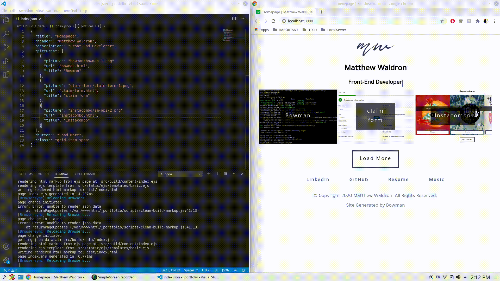

# Bowman

  

A simple static site generator with an integrated toolchain for efficient development and delivery. [Click here to see it live on Netlify](https://bowman.netlify.app).

## Introduction

Bowman is a simple static site generator powered by Node.js, Webpack, and Browsersync. Bowman comes with pre-configured scripts to bundle assets, generate markup, and hot-reload pages. Pages are generated using the J.E.N. technology core (JSON - data, EJS - templating, Node.js - markup generation).

## Installation

Install globally:

        npm i -g @waldronmatt/bowman

Create project:

       create-bowman-starter -y
        
Install dependencies:

        npm install

## Getting Started

Run dev environment:

        npm run dev

Build and serve for production:

        npm run build

## Languages
Use core front-end languages and JavaScript-like technologies to build your site.
- Next-Gen JavaScript
- Sass
- EJS - generate HTML markup with plain JavaScript
- JSON - store page text/data

## Workflow
Utilize a complete workflow of industry-leading software:
- Webpack: module bundler
    - webpack-livereload-plugin: trigger reloads from webpack's build pipeline while serving assets using Browsersync
    - webpack-hot-middleware: add hot-reloading capabilities to Browsersync
    - webpack-dev-middleware: extend BrowserSync's server abilities to support hot-reloading of page assets
- Browsersync: Development server for serving assets
- Autoprefixer: Automatically add vendor prefixes to styles
- Babel: Transpile to different versions of EcmaScript
- Browserlist: Configure which browsers will be supported
- Prettier: Formatter for scripts and styles
- ESLint: Linting for scripts
    - eslint-config-airbnb-base: a popular eslint ruleset
    - eslint-plugin-prettier: turns off unnecessary or conflicting eslint rules with prettier
- StyleLint: Linting for styles
    - stylelint-config-standard: a popular stylint ruleset
    - stylelint-config-prettier: turns off unnecessary or conflicting stylelint rules with prettier
- EditorConfig: general file formatter for your editor/IDE

## Features
Take advantage of Bowman's build scripts with performance and best practices built in:
- Bowman
    - Recursively find, generate, and minify html markup
    - JSON cache prevention and file watch debouncing for robust page hot-reloading
- Webpack
    - Recursively find and output entry points
    - Transpile Next-Gen JavaScript using Babel
    - Compile Sass using Webpack loaders
    - Manifest generation for assets so you can reference in your markup
    - Minify js and css
    - Compress images and generate next-gen image formats
- Browsersync
    - Serve pages and assets for development

## Bowman Starter Template
Bowman comes with a default template with the following features:
- ~100% Lighthouse Score on Mobile and Desktop (Excluding PWA)
- Contains popular, pre-configured webpack optimizations with examples:
    - cache busting using [contenthash]
    - code splitting:
        - dynamic loading
        - lazy loading
        - prefetch
    - splitchuncks integration:
        - vendors.js (npm dependencies)
        - commons.js (shared code)
    - tree-shaking (dead-code elimination) support via prod builds
- Polyfill support
- Eliminates render blocking js/css
- Next-gen image and fallback support for production builds
- Critical css and favicon generation support
- Popular css reset and normalizing libraries
- Suggested folder structure for an organized project

## Usage

### Create the markup

        build/
            content/
                my-page.ejs

my-page.ejs

        <h1><%= data.info.header %></h1>

        

            
<%= data.info.description %>

        

### Create the data

        build/
            data/
                my-page.json

my-page.json

        {
            "title": "My Page",
            "info": {
                "header": "Hello World!",
                "description": "This is my cool new page."
            }
        }

## Documentation
[Read the full documentation](https://waldronmatt.github.io/bowman/)

## Limitations
Bowman has several caveats/unsupported features:
- file/folder structures must match for page data and markup
    - the decision was made to keep both build/content/ and build/data/ the same structure in order to easily automate variable page generation
- webpackPreload magic comment not supported
    - needs webpack html plugin to work
- font file loading - since we're replying on sass to import, we have to use webpack copy plugin during the build
    - cannot support font cache-busting

## Contributing

Pull requests are welcome! For major changes, please open an issue first to discuss what you would like to change.

## License

MIT

## Credits

- CLI authored by Dominik Kundel's [create-project](https://github.com/dkundel/create-project)
